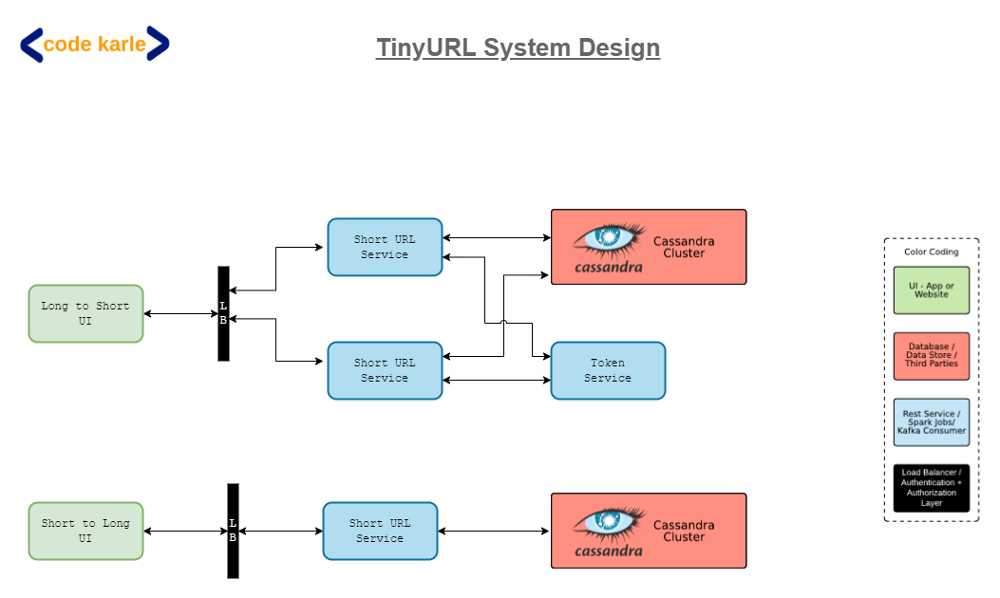

# 📚 Sistema de Encurtamento de URL (TinyURL) — System Design

## 📸 Preview da solução



## 🧠 Introdução

Serviços de **encurtamento de URL** são amplamente utilizados na internet para transformar links longos em versões menores e mais fáceis de compartilhar.

Exemplo:

```
URL original:
https://www.exemplo.com/artigos/tecnologia/2026/03/arquitetura-de-microsservicos

URL encurtada:
https://tiny.url/Ab3dE1
```

Esses serviços são utilizados em plataformas como:

* Redes sociais
* Campanhas de marketing
* Mensagens SMS
* Aplicações mobile

Neste material vamos estudar **como projetar um sistema de encurtamento de URL em escala global**, semelhante ao **TinyURL ou Bitly**, abordando:

* Requisitos funcionais e não funcionais
* Dimensionamento do sistema
* Geração de URLs únicas
* Arquitetura distribuída
* Prevenção de colisões
* Estratégias de alta disponibilidade
* Sistema de analytics

---

## 📖 Conceitos Fundamentais

Antes de analisar a arquitetura, é importante entender alguns conceitos essenciais.

### 🔹 Encurtamento de URL

Processo de converter uma **URL longa** em uma **URL curta única**.

```
Long URL → Short URL
```

Exemplo:

```
https://meusite.com/artigos/arquitetura-de-sistemas

↓
https://tiny.io/aZ9K2L
```

---

### 🔹 Redirecionamento

Quando um usuário acessa o link curto:

```
https://tiny.io/aZ9K2L
```

O sistema deve:

1. Consultar o banco de dados
2. Encontrar a URL original
3. Redirecionar o usuário

---

### 🔹 Colisão (Collision)

Uma **colisão ocorre quando dois links diferentes recebem o mesmo código curto**.

Exemplo incorreto:

```
tiny.io/abc123 → google.com
tiny.io/abc123 → facebook.com
```

Isso **não pode acontecer**, portanto o sistema precisa garantir **unicidade global**.

---

### 🔹 Base62 Encoding

Para gerar URLs curtas usamos normalmente **62 caracteres**:

```
[a-z] = 26
[A-Z] = 26
[0-9] = 10

Total = 62 caracteres
```

Esse conjunto permite gerar muitas combinações.

---

### 🔹 Escalabilidade

O sistema precisa suportar:

* **Bilhões ou trilhões de URLs**
* **Alta taxa de acesso**
* **Baixa latência**

---

## 🔎 Explicação Detalhada

## 1️⃣ Requisitos do Sistema

### 📌 Requisitos Funcionais (FR)

O sistema deve permitir:

1️⃣ Converter **URL longa → URL curta**

2️⃣ Redirecionar **URL curta → URL longa**

---

### 📌 Requisitos Não Funcionais (NFR)

O sistema deve possuir:

* **Alta disponibilidade**
* **Baixa latência**
* **Escalabilidade**
* **Tolerância a falhas**

Esse tipo de sistema geralmente roda em **grandes plataformas** como:

* Facebook
* Twitter
* LinkedIn

Portanto, a resposta deve ser **extremamente rápida**.

---

# 2️⃣ Dimensionamento do URL curto

Precisamos calcular **quantos caracteres a URL curta deve ter**.

### Supondo:

* X requisições por segundo
* Vida útil do link: **10 anos**

Cálculo:

```
URLs por segundo = X
URLs por minuto = X × 60
URLs por hora = X × 60 × 60
URLs por dia = X × 60 × 60 × 24
URLs por ano = X × 60 × 60 × 24 × 365
URLs em 10 anos = valor × 10
```

Chamaremos esse número de:

```
Y = total de URLs necessárias
```

---

### Quantas combinações podemos gerar?

Usando **Base62**:

```
62^n
```

Onde:

```
n = tamanho da URL curta
```

Exemplos:

| Tamanho | Combinações   |
| ------- | ------------- |
| 5       | ~916 milhões  |
| 6       | ~56 bilhões   |
| 7       | ~3.5 trilhões |

Por isso **7 caracteres é muito comum**.

---

# 3️⃣ Arquitetura Inicial do Sistema

A arquitetura básica funciona assim:

Fluxo:

```
User
 ↓
Load Balancer
 ↓
Short URL Service
 ↓
Database
```

### Passos:

1️⃣ Usuário envia URL longa

2️⃣ Serviço gera URL curta

3️⃣ Salva no banco

4️⃣ Retorna para o usuário

---

# 4️⃣ Problema de Colisão

Se tivermos **várias instâncias do serviço**, cada uma pode gerar o mesmo número.

Exemplo:

```
Server A → 111
Server B → 111
```

Isso cria **duplicação**.

---

# 5️⃣ Solução Inicial com Redis

Uma abordagem é usar **Redis como contador global**.

Fluxo:

```
Short URL Service
     ↓
Redis INCR
     ↓
Retorna número único
```

Depois:

```
Número → Base62 → URL curta
```

---

### Problema

Redis vira um:

🚨 **Single Point of Failure**

Se Redis cair:

```
Sistema inteiro para
```

Também pode sofrer:

* Limite de throughput
* Gargalo de rede

---

# 6️⃣ Solução Escalável — Token Service

Uma solução melhor é **distribuir intervalos de tokens**.

Arquitetura:

```
Short URL Services
        ↓
Token Service
        ↓
MySQL
```

---

### Como funciona

O **Token Service distribui intervalos de números**.

Exemplo:

| Serviço   | Intervalo   |
| --------- | ----------- |
| Service A | 1 – 1000    |
| Service B | 1001 – 2000 |
| Service C | 2001 – 3000 |

Cada serviço usa seu próprio intervalo.

---

### Exemplo de fluxo

```
Request chega

ShortURLService usa:
token = 1001

1001 → Base62 → "aZ91d"
```

Salva no banco.

---

### Quando o intervalo acaba

O serviço solicita outro.

Exemplo:

```
5001 – 6000
```

---

### Vantagens

✔ Evita colisões
✔ Escala horizontalmente
✔ Sem ponto único de falha
✔ Menos chamadas ao serviço central

---

# 7️⃣ Banco de Dados

Precisamos armazenar:

```
short_url → long_url
```

Exemplo:

| Short | Long                                               |
| ----- | -------------------------------------------------- |
| Ab3D9 | [https://site.com/artigo](https://site.com/artigo) |

---

### Por que usar Cassandra?

Porque ele oferece:

* **Alta escalabilidade**
* **Alta disponibilidade**
* **Distribuição global**
* **Alta taxa de escrita**

Alternativas:

* MySQL com sharding
* DynamoDB
* Bigtable

---

# 8️⃣ Fluxo de Redirecionamento

Quando alguém acessa um link curto:

```
User → tiny.url/Ab3D9
```

Fluxo:

```
Load Balancer
   ↓
Short URL Service
   ↓
Cassandra
   ↓
Long URL
   ↓
HTTP Redirect
```

---

# 9️⃣ Sistema de Analytics

Empresas querem saber:

* Quantos cliques
* País de origem
* Dispositivo
* Plataforma

Para isso coletamos:

* IP
* User-Agent
* Referer
* Plataforma

---

# 🔟 Pipeline de Analytics

Arquitetura:

```
Request
  ↓
Short URL Service
  ↓
Kafka
  ↓
Analytics Pipeline
```

---

### Dados coletados

* IP
* País
* Plataforma
* Navegador
* Timestamp

---

### Processamento

Pode ser feito com:

* **Spark Streaming**
* **Hadoop + Hive**
* **Data Warehouse**

---

# 1️⃣1️⃣ Otimização de Performance

Escrever no Kafka **a cada requisição** pode aumentar latência.

Solução:

### Batch processing

Agrupar eventos localmente.

Exemplo:

```
Memória local
↓
Buffer
↓
Flush a cada 10 segundos
↓
Kafka
```

Benefícios:

✔ menos I/O
✔ menor latência
✔ maior throughput

---

## 💡 Exemplos práticos

### Exemplo de geração de URL

Token recebido:

```
125
```

Conversão Base62:

```
125 → cb
```

URL final:

```
tiny.url/cb
```

---

### Exemplo de banco

```
Table: urls

short_code | long_url
----------------------------
Ab12d3 | https://google.com
Xy91aQ | https://github.com
```

---

## ⚠️ Pontos importantes

* Evitar **colisão de URLs**
* Evitar **single point of failure**
* Manter **latência muito baixa**
* Banco deve suportar **bilhões de registros**
* Analytics não pode impactar performance

---

## 📝 Resumo do conteúdo

Este sistema implementa um **serviço global de encurtamento de URLs**.

Componentes principais:

* **Load Balancer**
* **Short URL Service**
* **Token Service**
* **Cassandra Database**
* **Kafka Analytics Pipeline**

Fluxos principais:

1️⃣ Criar URL curta
2️⃣ Redirecionar para URL longa
3️⃣ Coletar analytics

O sistema usa:

* **Base62 encoding**
* **Token ranges**
* **Cassandra para escala**
* **Kafka para analytics**

---

## 🎯 Perguntas para revisão

1️⃣ Por que usamos **Base62** em sistemas de encurtamento de URL?

2️⃣ O que é **colisão de URL** e por que é um problema?

3️⃣ Por que **Redis como contador global pode ser perigoso**?

4️⃣ Qual a vantagem de usar **Token Service com intervalos**?

5️⃣ Por que **Cassandra é mais adequado que MySQL simples** nesse caso?

---

## 📌 Conclusão

Projetar um sistema de encurtamento de URL parece simples à primeira vista, mas em escala global envolve desafios importantes:

* geração de **identificadores únicos**
* **alta disponibilidade**
* **baixa latência**
* **distribuição geográfica**
* **análise de dados**

A arquitetura apresentada resolve esses problemas utilizando:

* **Token ranges distribuídos**
* **Cassandra para armazenamento massivo**
* **Kafka para analytics**
* **serviços distribuídos escaláveis**

Esse tipo de problema é **extremamente comum em entrevistas de System Design** e ajuda a demonstrar domínio de:

* arquitetura distribuída
* escalabilidade
* tolerância a falhas
* processamento de dados em larga escala

---

Responder **System Design (ex: TinyURL)** em entrevistas de empresas como **FAANG** não é apenas saber a solução. O avaliador quer ver **como você pensa**, **como estrutura o problema** e **como toma decisões técnicas**.

Vou te mostrar **o framework usado por engenheiros de Big Tech** para responder esse tipo de pergunta. 🚀

---

# 🧠 Como responder perguntas de System Design em entrevistas FAANG

Existe uma estrutura clássica usada por engenheiros de empresas como:

* Google
* Meta
* Amazon
* Netflix

A estrutura geralmente segue **6 etapas principais**.

---

# 1️⃣ Clarificar o problema (2–3 minutos)

A primeira coisa **não é desenhar arquitetura**.

Primeiro você **faz perguntas**.

Isso mostra maturidade de engenharia.

### Perguntas típicas

Exemplo para TinyURL:

* O link expira?
* O usuário pode customizar o link?
* Precisamos de analytics?
* Precisamos suportar quantos requests por segundo?
* O sistema é público ou interno?
* Precisamos suportar múltiplas regiões?

---

### Exemplo de resposta na entrevista

Você poderia dizer:

> “Before designing the system, I’d like to clarify a few requirements.”

Depois pergunta:

* Expected traffic?
* URL expiration?
* Custom alias support?
* Analytics requirement?

Isso mostra **pensamento estruturado**.

---

# 2️⃣ Definir requisitos

Depois organize em **FR e NFR**.

### Functional Requirements (FR)

* Converter URL longa → URL curta
* Redirecionar URL curta → URL longa
* Opcional: analytics

---

### Non Functional Requirements (NFR)

* Alta disponibilidade
* Baixa latência
* Escalabilidade
* Consistência eventual aceitável

---

💡 Isso mostra que você entende **trade-offs de sistemas distribuídos**.

---

# 3️⃣ Estimativas de escala (Back-of-the-Envelope)

FAANG gosta muito disso.

Você faz **cálculos rápidos de escala**.

### Exemplo

Suponha:

```
100M URLs criadas por dia
```

Em 10 anos:

```
100M × 365 × 10
≈ 365 bilhões URLs
```

Agora calcula o tamanho do código curto.

Se usar Base62:

```
62^6 ≈ 56 bilhões
62^7 ≈ 3.5 trilhões
```

Então:

```
7 caracteres é suficiente
```

Esse tipo de cálculo impressiona entrevistadores.

---

# 4️⃣ High-Level Architecture

Agora você desenha algo simples primeiro.

Arquitetura inicial:

```
Client
   ↓
Load Balancer
   ↓
Application Servers
   ↓
Database
```

Explique o fluxo.

### Criar URL

```
User → API
      → gerar código
      → salvar DB
      → retornar short URL
```

---

### Redirecionamento

```
User → shortURL
      → lookup DB
      → redirect
```

---

# 5️⃣ Deep Dive nos problemas difíceis

Agora você entra nas partes **que realmente importam**.

Aqui o entrevistador avalia seu nível.

---

## Problema 1 — Gerar IDs únicos

Explique opções:

### Opção 1 — Hash

```
hash(longURL)
```

Problema:

* colisões
* difícil garantir unicidade

---

### Opção 2 — contador global

```
Redis INCR
```

Problema:

* single point of failure

---

### Opção 3 — Token ranges (melhor)

Cada servidor recebe intervalos:

```
Server A → 1–1M
Server B → 1M–2M
Server C → 2M–3M
```

Depois converte para Base62.

Essa solução **é bem vista em entrevistas**.

---

## Problema 2 — Banco de dados

Você explica escolhas.

Opções:

### SQL

```
MySQL
```

Problema:

* bilhões de registros

---

### Melhor escolha

Banco distribuído:

* Apache Cassandra
* DynamoDB

Motivos:

* alta escrita
* replicação
* escalabilidade horizontal

---

## Problema 3 — Latência

Melhoria:

Adicionar cache.

Exemplo:

```
Redis Cache
```

Fluxo:

```
Short URL
    ↓
Cache
    ↓
Database
```

---

## Problema 4 — Analytics

Para métricas use pipeline de eventos:

* Apache Kafka
* Apache Spark

Fluxo:

```
Request
  ↓
Kafka
  ↓
Spark
  ↓
Data Warehouse
```

---

# 6️⃣ Melhorias finais (Senior Level)

Essa parte diferencia **junior vs senior**.

Você pode falar de:

### Cache

```
Redis
```

---

### Multi-region

```
Global Load Balancer
```

---

### CDN

Para reduzir latência.

Exemplo:

* Cloudflare

---

### Rate limiting

Evitar spam.

---

### TTL de URLs

Links podem expirar.

---

# 🎯 Estrutura ideal de resposta na entrevista

Siga sempre essa ordem:

```
1 Clarify requirements
2 Define FR / NFR
3 Estimate scale
4 High level architecture
5 Deep dive
6 Optimizations
```

Tempo típico:

| Etapa        | Tempo  |
| ------------ | ------ |
| Clarificação | 2 min  |
| Requisitos   | 3 min  |
| Estimativas  | 5 min  |
| Arquitetura  | 10 min |
| Deep dive    | 15 min |
| Melhorias    | 5 min  |

---

# ⚠️ Erros que fazem candidatos falhar

❌ Começar desenhando arquitetura
❌ Não perguntar requisitos
❌ Ignorar escala
❌ Não falar de trade-offs
❌ Não considerar falhas

---

# 🏆 Exemplo de frase final na entrevista

Algo assim impressiona muito:

> “This system is highly available, horizontally scalable, avoids single points of failure and can support trillions of URLs using Base62 encoding with distributed token allocation.”

---

💡 Se quiser, posso também te mostrar:

* **como FAANG espera que você desenhe esse sistema no quadro**
* **uma resposta completa de 10 minutos que passa em entrevistas**
* **os 15 problemas de System Design mais comuns em Big Tech**.
